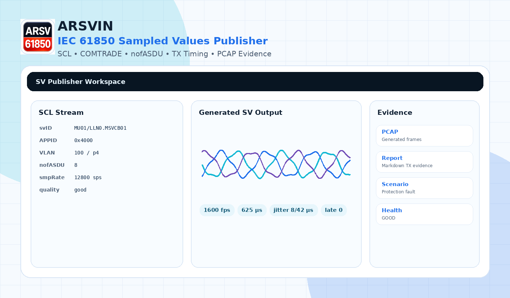

# ARSVIN — IEC 61850 Sampled Values Publisher for Windows

[](https://github.com/masarray/arsvin/actions/workflows/ci.yml)
[](https://github.com/masarray/arsvin/actions/workflows/release.yml)
[](https://github.com/masarray/arsvin/actions/workflows/codeql.yml)
[](LICENSE)
[](#requirements)
[](#build-from-source)

**ARSVIN** is an Apache-2.0 IEC 61850 **Sampled Values Publisher** for Windows. It helps substation automation engineers publish SV streams from SCL settings, replay COMTRADE records, run repeatable publisher scenarios, and export TX-side evidence for controlled lab work.

<p align="center">
  
</p>

<p align="center">
  <a href="https://github.com/masarray/arsvin/releases"><strong>Download latest release</strong></a> ·
  <a href="https://masarray.github.io/arsvin/"><strong>Landing page</strong></a> ·
  <a href="docs/quick-start.md"><strong>Quick start</strong></a> ·
  <a href="docs/index.md"><strong>Documentation</strong></a>
</p>

> [!WARNING]
> ARSVIN transmits raw Ethernet frames. Use it only on isolated lab networks, point-to-point test links, or networks where you have explicit authorization. ARSVIN is **not** a certified relay test set, calibrated current/voltage source, calibrated merging unit, production process-bus tool, or certified IEC 61850-9-3 PTP grandmaster.

## Why ARSVIN exists

IEC 61850 Sampled Values testing often needs transparent tooling: a way to inspect stream settings, publish repeatable SV frames, replay simple analog records, and preserve evidence without hiding the implementation behind a black box. ARSVIN focuses on that workflow.

ARSVIN is intentionally narrow:

```text
SCL-driven SV publishing → TX timing visibility → generated PCAP/report evidence
```

It does **not** try to replace StationScout, Wireshark, IEDScout, Omicron-class test sets, RTDS/HIL platforms, or certified conformance tools.

## Key capabilities

| Capability | What it does |
|---|---|
| IEC 61850 SV publisher | Publishes Ethernet Sampled Values frames from a Windows workstation using Npcap. |
| SCL-driven setup | Reads APPID, destination MAC, VLAN, `svID`, dataset, `confRev`, `smpRate`, `smpMod`, and `nofASDU` from SCL/SCD. |
| Multi-ASDU packing | Supports `nofASDU=1/2/4/8` for lab-oriented SV frame packing. |
| Multi-stream publishing | Runs up to three independent publisher slots for repeatable lab streams. |
| COMTRADE replay | Replays ASCII, BINARY, BINARY32, and FLOAT32 analog COMTRADE records as SV values. |
| Publisher scenarios | Generates balanced and per-phase state sequencer presets: 3P fault, A-G fault, B-C fault, negative/zero sequence, CT saturation stress, VT fuse fail, harmonic injection, DC offset, frequency steps, phase jump, and load reversal. |
| TX Timing Health | Reports target FPS, actual FPS, jitter, late frames, missed schedule count, send duration, and overall TX health. |
| PCAP evidence export | Exports generated SV frames to PCAP for offline inspection in Wireshark or other packet tools. |
| Markdown evidence report | Exports TX-side publisher evidence with stream settings, preflight findings, timing health, and scenario metadata. |
| Safety-first UX | Preflight warnings and explicit boundaries keep live publishing decisions visible. |

## Supported publishing profiles

| Area | Current support | Notes |
|---|---|---|
| IEC 61850 Sampled Values APDU | Lab publisher implementation | Focused on generated SV streams, not certified conformance. |
| IEC 61850-9-2LE style 4I+4V | Supported as lab profile | Includes sample SCL and common 4 current + 4 voltage payload shape. |
| `nofASDU` | `1`, `2`, `4`, `8` | Sample counter advances per ASDU. |
| Quality bits | Good, invalid, questionable, oldData, test, operatorBlocked | Used for intentional relay behavior tests. |
| PTP / `smpSynch` | Compatibility/lab behavior only | Not a certified IEC 61850-9-3 timing implementation. |
| IEC 61869-9 generic datasets | Partial/future | See [SV profile support](docs/sv-profile-support.md). |

## Common workflows

### Publish from SCL

1. Open an SCL/SCD file.
2. Select Publisher 1, 2, or 3.
3. Choose an SV stream.
4. Review APPID, MAC, VLAN, `svID`, dataset, `smpRate`, `smpMod`, and `nofASDU`.
5. Run dry mode first.
6. Publish live only on an isolated lab link.

### Replay COMTRADE as SV

1. Load a COMTRADE `.cfg` and matching `.dat`.
2. Map analog channels to current/voltage fields.
3. Select the SV stream profile.
4. Publish or export generated evidence.

### Preserve TX-side evidence

1. Run preflight.
2. Start a dry run or live publisher session.
3. Check TX Timing Health.
4. Export generated PCAP.
5. Export Markdown evidence report.

## Companion app: ARSVIN Subscriber

This repository now includes **ARSVIN Subscriber**, a separate WPF receiver-side verification companion for ARSVIN Publisher. It listens to IEC 61850 Sampled Values on an Npcap adapter, binds received streams to SCL when available, verifies APPID/VLAN/svID/confRev/nofASDU/sample-rate/payload layout, tracks `smpCnt` health, decodes values, and exports a receiver-side evidence report.

Build it with:

```powershell
dotnet build .\src\ARSVIN.Subscriber\ARSVIN.Subscriber.csproj -c Release
```

The subscriber proves that **this PC/NIC** receives and decodes the stream. It does not prove that a relay or IED consumed the multicast SV stream. See [`docs/subscriber-verification-app.md`](docs/subscriber-verification-app.md).

## Quick start

### Download portable release

1. Install [Npcap](https://npcap.com/) on Windows.
2. Download `ARSVIN-win-x64-portable.zip` from [Releases](https://github.com/masarray/arsvin/releases).
3. Extract the ZIP.
4. Run `ARSVIN.exe` as Administrator when live publishing raw Ethernet frames.
5. Open a sample SCL from `samples/scl` or your lab SCD.
6. Start with dry mode before live TX.

See [Quick Start](docs/quick-start.md) for the full flow.

## Requirements

For users:

- Windows 10/11 x64
- Npcap for live Ethernet publishing
- Administrator rights for live packet transmission
- Wireshark or equivalent tool for independent packet inspection

For developers:

- Windows 10/11 x64
- .NET 8 SDK
- PowerShell 7+ recommended
- Visual Studio 2022, Rider, or VS Code with C# tooling

## Build from source

```powershell
git clone https://github.com/masarray/arsvin.git
cd arsvin
.\build.ps1
```

Create a portable Windows package:

```powershell
.\publish-win-x64.ps1
```

Run tests:

```powershell
dotnet test tests/ARSVIN.Tests/ARSVIN.Tests.csproj -c Release
```

## Repository structure

```text
src/ARSVIN/                 WPF desktop application and IEC 61850 publisher engine
tests/ARSVIN.Tests/         Unit tests for protocol primitives and publisher helpers
docs/                       Engineering documentation, safety notes, and public launch docs
samples/                    SCL, COMTRADE, scenario, and evidence samples
site/                       Static GitHub Pages landing page
.github/workflows/          CI, CodeQL, Pages, and release automation
```

## Documentation

Start with [Documentation Index](docs/index.md), or jump directly to:

- [Quick Start](docs/quick-start.md)
- [SV Profile Support](docs/sv-profile-support.md)
- [P0 Publisher Protocol Roadmap](docs/p0-publisher-protocol-roadmap.md)
- [P1 Publisher Evidence Workflow](docs/p1-publisher-evidence-workflow.md)
- [P2 Full Publisher Scenario Engine](docs/p2-full-publisher-scenarios.md)
- [Waveform Shape Panel](docs/waveform-shape-panel.md)
- [Multi-Stream SV Publishing](docs/multi-stream.md)
- [COMTRADE Replay](docs/comtrade-replay.md)
- [TX Safety Boundaries](docs/safety-boundaries.md)
- [PTP and smpSynch Compatibility](docs/ptp-and-smpsynch.md)
- [Build and Release](docs/build-and-release.md)
- [SEO and Public Launch Checklist](docs/seo-public-launch-checklist.md)

## What ARSVIN is not

ARSVIN is not:

- a live SV subscriber/analyzer,
- a certified IEC 61850 conformance test tool,
- a calibrated merging unit,
- a protection trip-time validation platform,
- a production process-bus diagnostic suite,
- a replacement for relay vendor tools, StationScout, Wireshark, or Omicron-class test sets.

SV is multicast and unacknowledged. A publisher cannot know which IEDs are live subscribers unless that information is derived from complete SCL/SCD engineering data or from external tooling.

## SEO topics for GitHub

Set these in the GitHub repository **About → Topics** panel:

```text
iec61850
iec-61850
sampled-values
sampled-values-publisher
sv-publisher
sv-injector
merging-unit
merging-unit-simulator
process-bus
digital-substation
substation-automation
comtrade
ptp
wpf
dotnet
windows
```

Suggested GitHub About description:

```text
Apache-2.0 IEC 61850 Sampled Values Publisher for Windows — SCL-driven SV publishing, COMTRADE replay, nofASDU support, TX timing health, per-phase scenario presets, and PCAP evidence export.
```

## Contributing

Practical engineering contributions are welcome. Please read [CONTRIBUTING.md](CONTRIBUTING.md), keep pull requests focused, include test notes, and keep safety wording honest.

## Author

Created and maintained by **Ari Sulistiono**.

GitHub: [github.com/masarray](https://github.com/masarray)

## License

Apache License 2.0. See [LICENSE](LICENSE).

Third-party dependency notes are listed in [THIRD_PARTY_NOTICES.md](THIRD_PARTY_NOTICES.md).


## ArSubsv — Sampled Values Scout Companion

The repository now includes **ArSubsv**, a separate WPF receiver-side SV scout app. It provides live stream discovery, SCL-bound decoding, oscilloscope waveform visualization, phasor/RMS indicators, classic PCAP import, stream health checks, and Markdown evidence reports. It is not an OMICRON product and does not copy OMICRON branding; it targets the same engineering class of Sampled Values visualization while keeping the ARSVIN visual identity.

See [`docs/arsubsv-sv-scout-companion.md`](docs/arsubsv-sv-scout-companion.md).
