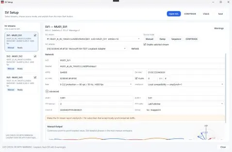
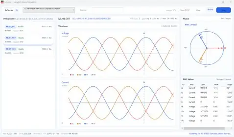
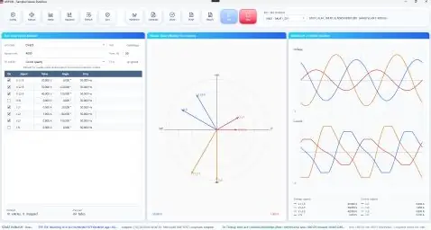

# ARSVIN — Open-Source IEC 61850 Sampled Values Workbench for Windows

[](https://github.com/masarray/arsvin/actions/workflows/ci.yml)
[](https://github.com/masarray/arsvin/actions/workflows/release.yml)
[](https://github.com/masarray/arsvin/actions/workflows/codeql.yml)
[](LICENSE)
[](#system-requirements)
[](#build-from-source)

**ARSVIN** is a focused, Apache-2.0 engineering suite for IEC 61850 Sampled Values on Windows. It combines an SCL-driven **SV Publisher** with **ArSubsv**, a live/PCAP **SV Subscriber and analysis companion** for transparent, repeatable laboratory workflows.

<p align="center">
  
</p>

<p align="center">
  <a href="https://github.com/masarray/arsvin/releases/latest"><strong>Download</strong></a> ·
  <a href="https://masarray.github.io/arsvin/"><strong>Product site</strong></a> ·
  <a href="docs/quick-start.md"><strong>Quick start</strong></a> ·
  <a href="docs/index.md"><strong>Documentation</strong></a> ·
  <a href="CONTRIBUTING.md"><strong>Contribute</strong></a>
</p>

> [!CAUTION]
> ARSVIN can capture and transmit raw Ethernet traffic. Use it only on isolated laboratory networks, point-to-point test links, or networks where you have explicit authorization. It is not a certified relay test set, calibrated merging unit, protection trip-time platform, production process-bus monitor, or IEC 61850 conformance tool.

## Real application views

| ArSubsv stream monitor | ArSubsv live analysis |
|---|---|
|  |  |

The screenshots above are captured from the actual Windows applications. They show the Publisher setup workflow and the Subscriber waveform, phasor, channel, RMS, and stream-analysis views.

## Two focused applications

| Application | Purpose | Typical workflow |
|---|---|---|
| **ARSVIN Publisher** | Generate IEC 61850 Sampled Values from SCL settings, manual values, scenarios, or COMTRADE records. | Configure → preflight → dry run/live TX → export PCAP and report. |
| **ArSubsv Subscriber** | Discover, receive, decode, visualize, and assess SV streams from a live Npcap adapter or PCAP file. | Capture/import → bind to SCL → inspect values, waveform, phasor, RMS, and stream health → export report. |

The tools are intentionally separated. Publisher evidence proves what the PC generated; Subscriber evidence proves what the selected PC/NIC received and decoded. Neither alone proves that a protection IED consumed the multicast stream.

## Key capabilities

### Publisher

- SCL/SCD stream setup for APPID, destination MAC, VLAN, `svID`, dataset, `confRev`, `smpRate`, `smpMod`, and `nofASDU`.
- Lab-oriented IEC 61850-9-2LE-style 4I+4V publishing.
- Multi-ASDU frame packing with `nofASDU=1/2/4/8`.
- Up to three independent publisher slots.
- Manual values, ramps, state sequences, per-phase scenarios, waveform shaping, and COMTRADE replay.
- Intentional quality-bit modes for controlled behavior checks.
- TX timing health: target/actual FPS, jitter, late frames, missed schedules, and send duration.
- Generated PCAP and Markdown evidence reports.

### Subscriber / ArSubsv

- Live SV capture through Npcap and offline classic-PCAP import.
- Stream discovery and SCL-assisted binding.
- APPID, VLAN, `svID`, `confRev`, `nofASDU`, sample-rate, and payload-layout checks.
- `smpCnt` continuity and stream-health diagnostics.
- Decoded instantaneous values, oscilloscope waveform, phasor, and RMS views.
- Receiver-side Markdown evidence reports.
- Shared-engine foundation for evidence-aware profile classification and configuration-versus-wire comparison; live UI integration remains a following milestone.

## Profile intelligence foundation

The shared engine now separates:

```text
Observed wire facts
Configured SCL expectations
Evidence-backed profile definitions
Explainable profile confidence
Strict or compatible mismatch findings
```

Sparse evidence cannot produce a false `Confirmed` result. Unknown or conflicting receive traffic remains observable, and the built-in catalog contains only a generic SCL-driven Layer-2 fallback until named-profile requirements are verified.

See [SV Profile Infrastructure](docs/sv-profile-infrastructure.md) and [SV Standards and Evidence Research Gate](docs/sv-research-gate.md).

## Release downloads

Every tagged release builds validated Windows x64 artifacts with stable filenames:

| Artifact | Use |
|---|---|
| `ARSVIN-Publisher-win-x64.exe` | Self-contained, single-file portable Publisher. |
| `ArSubsv-Subscriber-win-x64.exe` | Self-contained, single-file portable Subscriber. |
| `ARSVIN-Suite-Setup-win-x64.exe` | Installer containing both applications, Start Menu shortcuts, documentation, and uninstaller. |
| `ARSVIN-win-x64-portable.zip` | Portable suite folder containing both applications and essential documentation. |
| `ARSVIN-SBOM.cdx.json` | CycloneDX 1.5 software bill of materials for resolved NuGet dependencies. |
| `SHA256SUMS.txt` | SHA-256 checksums for release verification. |

Stable and prerelease tag builds publish signed GitHub artifact attestations for provenance. Verify a downloaded file with GitHub CLI:

```powershell
gh attestation verify .\ARSVIN-Suite-Setup-win-x64.exe --repo masarray/arsvin
```

Published GitHub Releases are immutable in the automated workflow. Corrections use a new semantic-version tag instead of replacing existing assets.

The binaries are currently **unsigned**. Windows SmartScreen may show an unknown-publisher warning. Releases do not silently install Npcap; download Npcap from its official website when live capture or transmission is required.

## Quick start

### Installer

1. Download `ARSVIN-Suite-Setup-win-x64.exe` from the latest release.
2. Install the suite.
3. Install Npcap separately for live Ethernet capture/transmission.
4. Open **ARSVIN Publisher** or **ArSubsv Subscriber** from the Start Menu.
5. Start with a dry run, sample file, PCAP import, or isolated point-to-point link.

### Portable

1. Download the Publisher or Subscriber portable `.exe`.
2. Run the selected application directly.
3. Run as Administrator only when the selected Npcap/live-network workflow requires it.

See [Quick Start](docs/quick-start.md) and [Build and Release](docs/build-and-release.md).

## Supported scope

| Area | Current status | Boundary |
|---|---|---|
| IEC 61850 Sampled Values APDU | Publisher and Subscriber implementation for engineering/lab use | Not certified conformance testing. |
| IEC 61850-9-2LE-style 4I+4V | Implemented laboratory workflow | Formal profile verification and broader device evidence remain pending. |
| Generic SCL-driven Layer-2 SV | Dataset-aware engine foundation | Unknown layouts remain visible; unsupported payload elements are diagnosed. |
| Evidence-aware profile detection | Engine infrastructure implemented | Named-profile definitions await verified source and device evidence. |
| `nofASDU` | UI workflows emphasize `1`, `2`, `4`, `8` | Publisher and receiver behavior is software/PC timing dependent. |
| COMTRADE | ASCII, BINARY, BINARY32, FLOAT32 analog replay | Verify scaling and channel mapping before live TX. |
| PTP / `smpSynch` | Compatibility and lab behavior | Not an IEC 61850-9-3 certified clock. |
| Windows timing | Best-effort scheduling with visible health metrics | Not deterministic real-time execution. |
| IED subscription proof | Not provided | SV multicast has no application-layer acknowledgement. |

## System requirements

For users:

- Windows 10 or Windows 11, x64.
- Npcap for live capture or transmission.
- Administrator permission when required by the local Npcap/network configuration.
- An independent packet dissector or process-bus analyzer is recommended for verification.

For developers:

- .NET 8 SDK, feature band 8.0.4xx.
- PowerShell 7+ recommended.
- Visual Studio 2022, JetBrains Rider, or VS Code with C# tooling.
- Inno Setup 6.7.1 when reproducing the automated installer build locally.

## Build from source

```powershell
git clone https://github.com/masarray/arsvin.git
cd arsvin
.\build.ps1
```

NuGet versions are centrally managed and committed `packages.lock.json` files lock the resolved dependency graph. Validated CI and release paths restore with `--locked-mode`.

Build all release artifacts except the installer:

```powershell
.\scripts\publish-release.ps1 -Version 0.4.0
```

Compatibility wrapper:

```powershell
.\publish-win-x64.ps1 -Version 0.4.0
```

Run tests with both repository coverage gates and retain TRX/Cobertura evidence:

```powershell
.\scripts\test-with-coverage.ps1 -MinimumWholeEngineLineCoverage 13 -MinimumLineCoverage 70
```

The current suite contains 74 deterministic tests. The complete shared `ARSVIN.Engine` baseline measures 13.35% line coverage across 16,312 instrumented production lines, with 2,178 covered lines. The protocol-core regression surface measures 70.47% across 2,120 lines, with 1,494 covered lines. CI enforces floors of 13% for the whole engine and 70% for protocol core.

Generate a CycloneDX SBOM after restoring the solution:

```powershell
.\scripts\generate-sbom.ps1 -Version 0.4.0
```

## Repository structure

```text
src/ARSVIN.Engine/                     Shared production engine project and source ownership
src/ARSVIN.Engine/AR.Iec61850/         IEC 61850, SCL, SV, MMS, capture, diagnostics, and protocol code
src/ARSVIN.Engine/AR.Iec61850/SampledValues/Profiles/  Profile observation, detection, and comparison engine
src/ARSVIN.Engine/AR.Iec61850.Transports.Npcap/  Npcap transport implementation
src/ARSVIN/                            Publisher application
src/ARSVIN.Subscriber/                 ArSubsv subscriber and visualization companion
tests/ARSVIN.Tests/                    Deterministic engine and publisher regression tests
installer/                             Inno Setup definition for the Windows suite
scripts/                               Repeatable release packaging and validation scripts
docs/                                  Engineering, safety, and contributor documentation
samples/                               SCL, COMTRADE, scenario, and evidence samples
site/                                  Static, SEO-ready GitHub Pages product site
.github/workflows/                     CI, CodeQL, Pages, and release automation
```

The shared engine is compiled once as `ARSVIN.Engine`, and its source is physically owned by the same `src/ARSVIN.Engine` project used by Publisher, Subscriber, and Tests.

## Documentation

- [Documentation index](docs/index.md)
- [Quick start](docs/quick-start.md)
- [SV standards and evidence research gate](docs/sv-research-gate.md)
- [SV conformance and interoperability matrix](docs/sv-evidence-matrix.md)
- [SV profile infrastructure](docs/sv-profile-infrastructure.md)
- [Profile detection output contract](docs/profile-detection-output.md)
- [Subscriber verification app](docs/subscriber-verification-app.md)
- [ArSubsv SV scout companion](docs/arsubsv-sv-scout-companion.md)
- [SV profile support](docs/sv-profile-support.md)
- [COMTRADE replay](docs/comtrade-replay.md)
- [Multi-stream publishing](docs/multi-stream.md)
- [Publisher evidence workflow](docs/p1-publisher-evidence-workflow.md)
- [Full publisher scenarios](docs/p2-full-publisher-scenarios.md)
- [Safety boundaries](docs/safety-boundaries.md)
- [PTP and `smpSynch` compatibility](docs/ptp-and-smpsynch.md)
- [Build and release](docs/build-and-release.md)

## Security and responsible use

Do not attach confidential station SCL/SCD files, relay credentials, production packet captures, or internal network plans to public issues. Report vulnerabilities through GitHub Security Advisories as described in [SECURITY.md](SECURITY.md).

## Contributing

Focused engineering contributions are welcome. Read [CONTRIBUTING.md](CONTRIBUTING.md), keep changes reviewable, include test evidence where practical, and preserve explicit safety boundaries.

## License

Copyright © 2026 Ari Sulistiono.

Licensed under the [Apache License 2.0](LICENSE). Third-party dependency notices are documented in [THIRD_PARTY_NOTICES.md](THIRD_PARTY_NOTICES.md).
